# Termux安装linux Ubuntu方法

這邊是整理termux安裝ubuntu方法

## Part 1：install ubuntu and gnome desktop

> source YT：https://www.youtube.com/watch?v=XYgJV7JkXJI
> source：https://technical-bot.blogspot.com/2022/10/how-to-install-ubuntu-gnome-desktop-on.html

Installation :

So first we need to install proot-distro

```bash
pkg update && pkg install proot-distro && pkg install x11-repo
```


Now install Ubuntu

```bash
proot-distro install ubuntu
```

Once Ubuntu is installed, then just login to it

```bash
proot-distro login ubuntu
```

Now install Gnome Desktop

```bash
apt update && apt install gnome-session-flashback -y && apt install gnome-terminal gnome-tweaks ubuntu-wallpapers dbus-x11 yaru-theme-gtk yaru-theme-icon -y
```

Once installation is completed the we need to setup VNCserver to access GUI, for that create a new session in termux and install vncserver

```bash
pkg install x11-repo -y && pkg install tigervnc xorg-xhost -y
```

Now start vncserver

```bash
vncserver -geometry 1280x720 -listen tcp :1 && DISPLAY=:1 xhost +
```

Now again go to ubuntu and create a file to start GNOME desktop

```bash
nano /usr/local/bin/vncstart
```

Paste following in it and save the file

```bash
#!/bin/sh
rm -rf /run/dbus/pid
dbus-daemon --system
dbus-launch 
DISPLAY=:1 $HOME/.vnc/xstartup
```

Give executable permission 

```bash
chmod +x /usr/local/bin/vncstart
```

Now create xstartup file for VNC

```bash
mkdir $HOME/.vnc && nano $HOME/.vnc/xstartup
```

paste following in it and save it

```bash
#!/bin/sh
export XKL_XMODMAP_DISABLE=1
unset SESSION_MANAGER
unset DBUS_SESSION_BUS_ADDRESS
[ -x /etc/vnc/xstartup ] && exec /etc/vnc/xstartup
[ -r $HOME/.Xresources ] && xrdb $HOME/.Xresources
xsetroot -solid grey
gnome-panel &
metacity &
gnome-flashback &
panel &
```

Give executable permission

```bash
chmod +x $HOME/.vnc/xstartup
```

Start GNOME desktop 

```bash
vncstart
```

Now open VNC viewer and create a connection with localhost:1 and connect to it.


## Part 2 ： setting gnome desktop  (YT：8:00 start)

1. put mouse right button > open terminal

```bash
sudo apt install ubuntu-wallpapers
```

2. put mouse right button > change backgroup

3. Applying Themes, icon & cursors

```bash
gnome-tweaks
```

4. Appearance

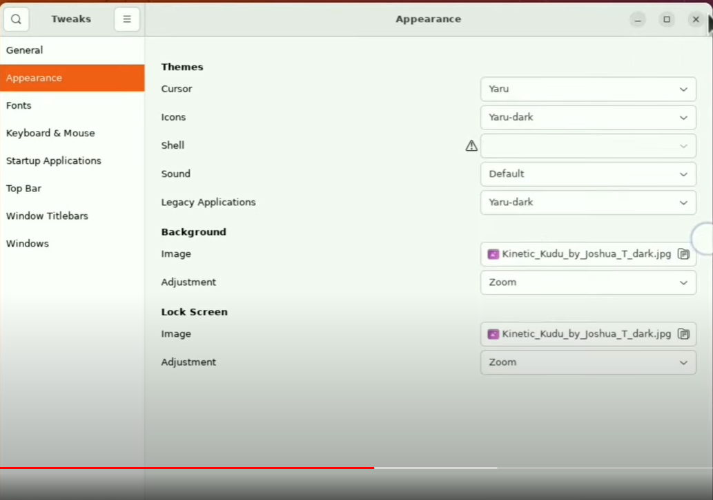

WINDOWS

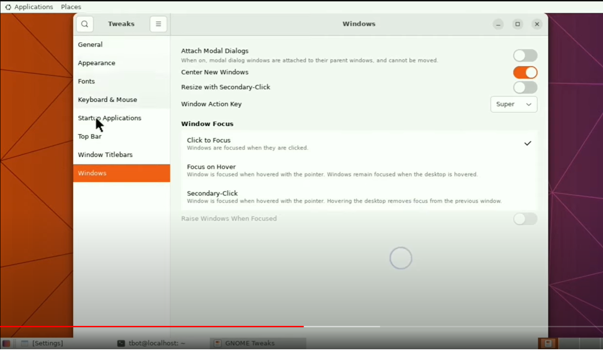

6. change backgroup > dark

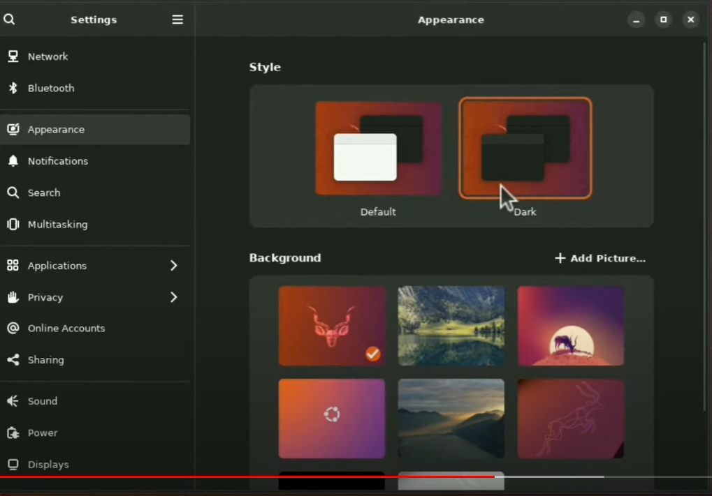

7. configuring panel

```bash
sudo apt intsall dconf-editor 
```

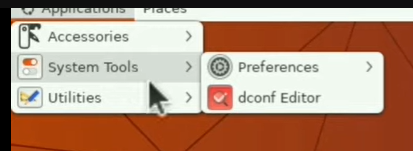

8. find /org/gnome/gnome-panel/layout

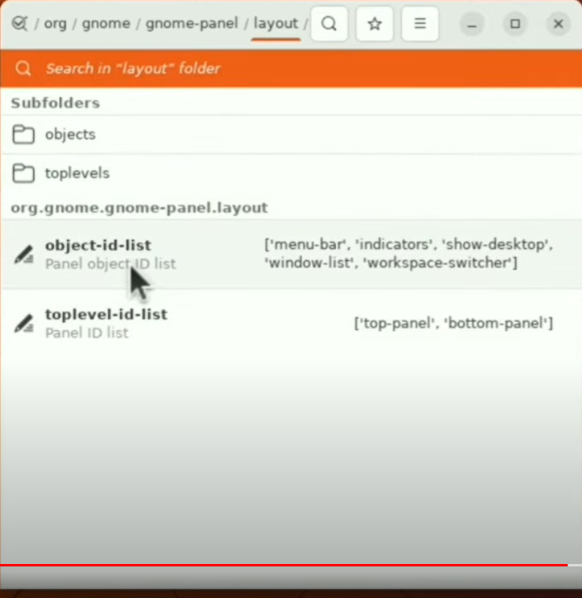

9. customer value setting：

   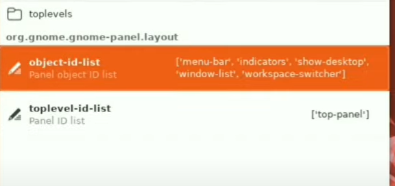

```bash
# object-id-list
['menu-bar','indicators','show-desktop','windows-list','workspace-switcher']
# toplevel-id-list
['top-panel']
```

10. general > confirm-panel-removal > open

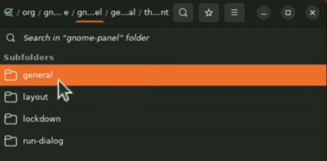

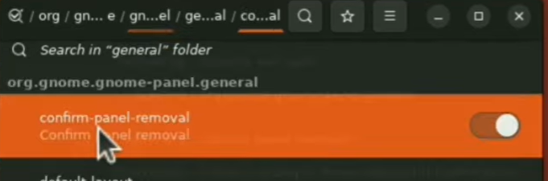

11. theme-variant setting

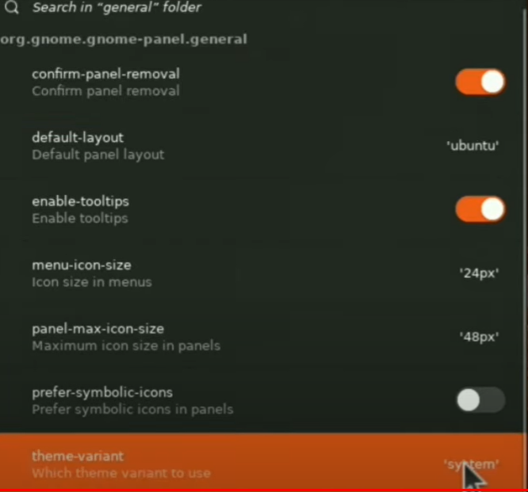

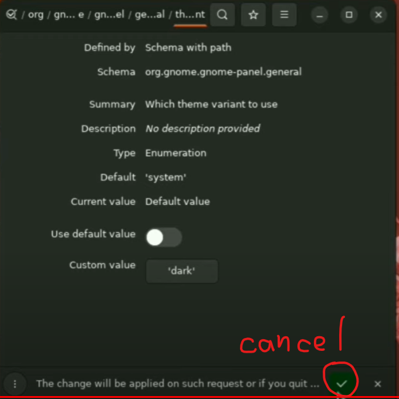

12. install plank & git

```bash
sudo apt install plank git -y
git clone https://github.com/monsene/plank-themes
cd plank-themes/Azeny/
mv Azeny $HOME/.config/plank/themes/
cd
# plank --prefernces
cd .config/plank
mv themes/Azeny/ $HOME/.local/share/plank/themes/
cd
plank --preferncesS
```

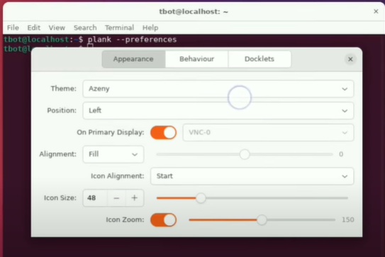

dockiets can add icon to menu bar

13.move gnome-tweaks icon

```
gnome-tweaks
```

14.install soft

```bash
sudo apt install gedit neofetch 
```

